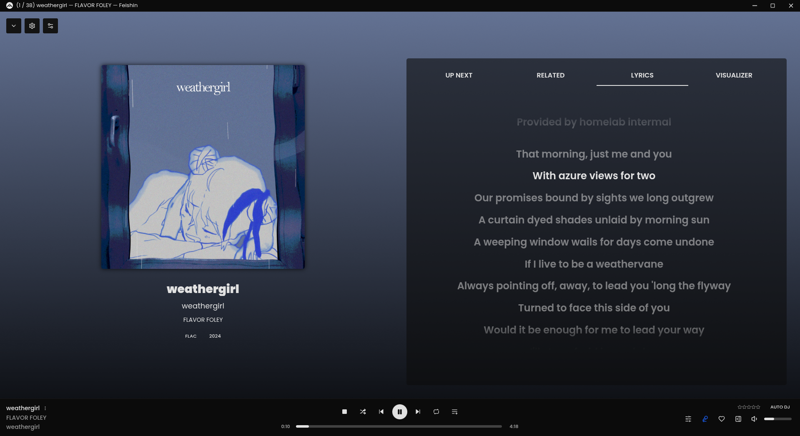

# iLe Muziq

  <p align="center">
    <a href="https://github.com/jeffvli/feishin/blob/main/LICENSE">
      
    </a>
      <a href="https://github.com/jeffvli/feishin/releases">
      
    </a>
    <a href="https://github.com/jeffvli/feishin/releases">
      
    </a>
  </p>
  <p align="center">
    <a href="https://discord.gg/FVKpcMDy5f">
      
    </a>
    <a href="https://matrix.to/#/#sonixd:matrix.org">
      
    </a>
  </p>

---

Rewrite of [Sonixd](https://github.com/jeffvli/sonixd).

## Features

- [x] MPV player backend
- [x] Web player backend
- [x] Modern UI
- [x] Scrobble playback to your server
- [x] Smart playlist editor (Navidrome)
- [x] Synchronized and unsynchronized lyrics support
- [ ] [Request a feature](https://github.com/jeffvli/feishin/issues) or [view taskboard](https://github.com/users/jeffvli/projects/5/views/1)

## Screenshots

<a href="./media/preview_full_screen_player.png"></a> <a href="./media/preview_album_artist_detail.png"></a> <a href="./media/preview_album_detail.png"></a> <a href="./media/preview_smart_playlist.png"></a>

## Getting Started

### Desktop (recommended)

Download the [latest desktop client](https://github.com/jeffvli/feishin/releases). The desktop client is the recommended way to use Feishin. It supports both the MPV and web player backends, as well as includes built-in fetching for lyrics.

#### macOS Notes

If you're using a device running macOS 12 (Monterey) or higher, [check here](https://github.com/jeffvli/feishin/issues/104#issuecomment-1553914730) for instructions on how to remove the app from quarantine.

For media keys to work, you will be prompted to allow Feishin to be a Trusted Accessibility Client. After allowing, you will need to restart Feishin for the privacy settings to take effect.

#### Linux Notes

We provide a small install script to download the latest `.AppImage`, make it executable, and also download the icons required by Desktop Environments. Finally, it generates a `.desktop` file to add Feishin to your Application Launcher.

Simply run the installer like this:

```sh
dir=/your/application/directory
curl 'https://raw.githubusercontent.com/jeffvli/feishin/refs/heads/development/install-feishin-appimage' | sh -s -- "$dir"
```

The script also has an option to add launch arguments to run Feishin in native Wayland mode. Note that this is experimental in Electron and therefore not officially supported. If you want to use it, run this instead:

```sh
dir=/your/application/directory
curl 'https://raw.githubusercontent.com/jeffvli/feishin/refs/heads/development/install-feishin-appimage' | sh -s -- "$dir" wayland-native
```

It also provides a simple uninstall routine, removing the downloaded files:

```sh
dir=/your/application/directory
curl 'https://raw.githubusercontent.com/jeffvli/feishin/refs/heads/development/install-feishin-appimage' | sh -s -- "$dir" remove
```

The entry should show up in your Application Launcher immediately. If it does not, simply log out, wait 10 seconds, and log back in. Your Desktop Environment may alternatively provide a way to reload entries.

### Web and Docker

Visit [https://feishin.vercel.app](https://feishin.vercel.app) to use the hosted web version of Feishin. The web client only supports the web player backend.

Feishin is also available as a Docker image. The images are hosted via `ghcr.io` and are available to view [here](https://github.com/jeffvli/feishin/pkgs/container/feishin). You can run the container using the following commands:

```bash
# Run the latest version
docker run --name feishin -p 9180:9180 ghcr.io/jeffvli/feishin:latest

# Build the image locally
docker build -t feishin .
docker run --name feishin -p 9180:9180 feishin
```

#### Docker Compose

To install via Docker Compose, use the following snippet. This also works on Portainer.

```yaml
services:
    feishin:
        container_name: feishin
        image: 'ghcr.io/jeffvli/feishin:latest'
        restart: unless-stopped
        environment:
            - SERVER_NAME=jellyfin # pre-defined server name
            - SERVER_LOCK=true # When true AND name/type/url are set, only username/password can be toggled
            - SERVER_TYPE=jellyfin # the allowed types are: jellyfin, navidrome, subsonic. These values are case insensitive
            - SERVER_URL= # http://address:port or https://address:port
            - REMOTE_URL= # http://address or https://address
            - LEGACY_AUTHENTICATION=false # When SERVER_LOCK is true, sets the legacy (plaintext) authentication flag for Subsonic/OpenSubsonic servers
            - ANALYTICS_DISABLED=true # Set to true to disable Umami analytics tracking
        ports:
            - 9180:9180
            # Alternatively, to restrict to only localhost, - 127.0.0.1:9180:8190
```

### Configuration

1. Upon startup you will be greeted with a prompt to select the path to your MPV binary. If you do not have MPV installed, you can download it [here](https://mpv.io/installation/) or install it using any package manager supported by your OS. After inputting the path, restart the app.

2. After restarting the app, you will be prompted to select a server. Click the `Open menu` button and select `Manage servers`. Click the `Add server` button in the popup and fill out all applicable details. See the [Server Setup Guide](docs/SERVERS.md) for more details. You will need to enter the full URL to your server, including the protocol and port if applicable (e.g. `https://navidrome.my-server.com` or `http://192.168.0.1:4533`).

- **Navidrome** - For the best experience, select "Save password" when creating the server and configure the `SessionTimeout` setting in your Navidrome config to a larger value (e.g. 72h).
    - **Linux users** - The default password store uses `libsecret`. `kwallet4/5/6` are also supported, but must be explicitly set in Settings > Window > Passwords/secret store.

3. _Optional_ - If you want to host Feishin on a subpath (not `/`), then pass in the following environment variable: `PUBLIC_PATH=PATH`. For example, to host on `/feishin`, pass in `PUBLIC_PATH=/feishin`.

4. _Optional_ - To hard code the server url, pass the following environment variables: `SERVER_NAME`, `SERVER_TYPE` (one of `jellyfin` or `navidrome` or `subsonic`), `SERVER_URL`. To prevent users from changing these settings, pass `SERVER_LOCK=true`. This can only be set if all three of the previous values are set. When `SERVER_LOCK=true`, you can also set `LEGACY_AUTHENTICATION=true` or `LEGACY_AUTHENTICATION=false` to configure the legacy authentication flag for the server (only applicable for Subsonic/OpenSubsonic servers).

5. _Optional_ - If your server uses a separate public-facing URL than what integrating applications use internally to communicate with your server, such as a separate Navidrome `ShareURL`, set `REMOTE_URL` to said public-facing URL.
 
6. _Optional_ - To disable Umami analytics tracking in the Docker/web version, set the environment variable `ANALYTICS_DISABLED=true`. When enabled, the analytics script will not be loaded and all tracking will be disabled.

7. _Optional_ - App settings (theme, language, sidebar options, etc.) can be overridden with environment variables on first run. The variables use the `FS_` prefix (e.g. `FS_GENERAL_THEME=defaultDark`, `FS_GENERAL_LANGUAGE=de`). See [the settings environment variable documentation](docs/ENV_SETTINGS.md) for the full list.

## FAQ

### MPV is either not working or is rapidly switching between pause/play states

First thing to do is check that your MPV binary path is correct. Navigate to the settings page and re-set the path and restart the app. If your issue still isn't resolved, try reinstalling MPV. Known working versions include `v0.35.x` and `v0.36.x`. `v0.34.x` is a known broken version.

### What music servers does Feishin support?

Feishin supports any music server that implements a [Navidrome](https://www.navidrome.org/), [Jellyfin](https://jellyfin.org/), or [OpenSubsonic compatible](https://opensubsonic.netlify.app/) API.

- [Navidrome](https://github.com/navidrome/navidrome)
- [Jellyfin](https://github.com/jellyfin/jellyfin)
- [OpenSubsonic](https://opensubsonic.netlify.app/) compatible servers, such as...
    - [Airsonic-Advanced](https://github.com/airsonic-advanced/airsonic-advanced)
    - [Ampache](https://ampache.org)
    - [Astiga](https://asti.ga/)
    - [Funkwhale](https://www.funkwhale.audio/)
    - [Gonic](https://github.com/sentriz/gonic)
    - [LMS](https://github.com/epoupon/lms)
    - [Nextcloud Music](https://apps.nextcloud.com/apps/music)
    - [Supysonic](https://github.com/spl0k/supysonic)
    - [Qm-Music](https://github.com/chenqimiao/qm-music)
    - More (?)

### I have the issue "The SUID sandbox helper binary was found, but is not configured correctly" on Linux

This happens when you have user (unprivileged) namespaces disabled (`sysctl kernel.unprivileged_userns_clone` returns 0). You can fix this by either enabling unprivileged namespaces, or by making the `chrome-sandbox` Setuid.

```bash
chmod 4755 chrome-sandbox
sudo chown root:root chrome-sandbox
```

Ubuntu 24.04 specifically introduced breaking changes that affect how namespaces work. Please see https://discourse.ubuntu.com/t/ubuntu-24-04-lts-noble-numbat-release-notes/39890#:~:text=security%20improvements%20 for possible fixes.

## Development

Built and tested using Node `v23.11.0`.

This project is built off of [electron-vite](https://github.com/alex8088/electron-vite)

- `pnpm run dev` - Start the development server
- `pnpm run dev:watch` - Start the development server in watch mode (for main / preload HMR)
- `pnpm run start` - Starts the app in production preview mode
- `pnpm run build` - Builds the app for desktop
- `pnpm run build:electron` - Build the electron app (main, preload, and renderer)
- `pnpm run build:remote` - Build the remote app (remote)
- `pnpm run build:web` - Build the standalone web app (renderer)
- `pnpm run package` - Package the project
- `pnpm run package:dev` - Package the project for development locally
- `pnpm run package:linux` - Package the project for Linux locally
- `pnpm run package:mac` - Package the project for Mac locally
- `pnpm run package:win` - Package the project for Windows locally
- `pnpm run publish:linux` - Publish the project for Linux
- `pnpm run publish:linux:beta` - Publish the project for Linux (beta channel)
- `pnpm run publish:linux-arm64` - Publish the project for Linux ARM64
- `pnpm run publish:linux-arm64:beta` - Publish the project for Linux ARM64 (beta channel)
- `pnpm run publish:mac` - Publish the project for Mac
- `pnpm run publish:mac:beta` - Publish the project for Mac (beta channel)
- `pnpm run publish:win` - Publish the project for Windows
- `pnpm run publish:win:beta` - Publish the project for Windows (beta channel)
- `pnpm run typecheck` - Type check the project
- `pnpm run typecheck:node` - Type check the project with tsconfig.node.json
- `pnpm run typecheck:web` - Type check the project with tsconfig.web.json
- `pnpm run lint` - Lint the project
- `pnpm run lint:fix` - Lint the project and fix linting errors
- `pnpm run i18next` - Generate i18n files

## Translation

This project uses [Weblate](https://hosted.weblate.org/projects/feishin/) for translations. If you would like to contribute, please visit the link and submit a translation.

## License

[GNU General Public License v3.0 ©](https://github.com/jeffvli/feishin/blob/dev/LICENSE)
